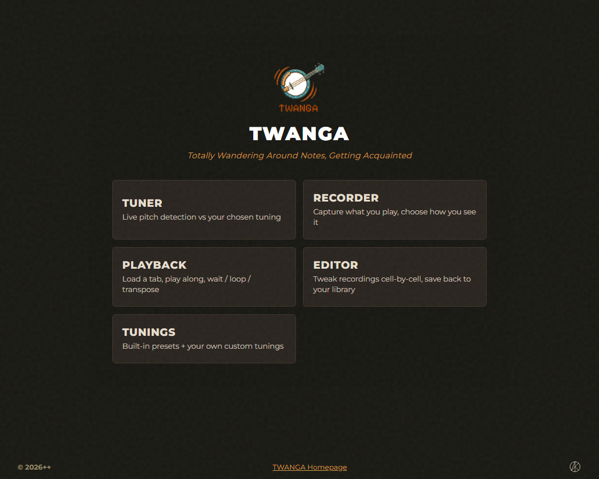

# TWANGA — GUI overview

The GUI is a single HTML + WASM bundle at [`frontend/web/`](../frontend/web/),
served two ways:

- **Web** — published to GitHub Pages at
  [andrewiankidd.github.io/TWANGA/app](https://andrewiankidd.github.io/TWANGA/app/).
  Same bundle the desktop shell hosts; no install needed.
- **Desktop (Tauri)** — [`crates/twanga-app/`](../crates/twanga-app/)
  wraps the same bundle in a native window. The shell now reads + writes
  the same filesystem the CLI does: recordings land in
  `$CONFIG/twanga/recordings/` (visible to `twanga play` immediately),
  user tunings sync with `$CONFIG/twanga/tunings.toml` (the file
  `twanga tunings add` writes), and external-link clicks open in the
  OS browser via the shell plugin.

Feature parity with the CLI ([docs/CLI.md](CLI.md)) is enforced — every
flag on `twanga` has an equivalent GUI control, and vice versa.



## Feature pages

Each feature page documents both its GUI screen and the CLI counterpart
in one place.

| Feature | Where in the GUI | Page |
|---------|------------------|------|
| Tuner | `#tuner` (Tuner card on the menu) | [features/tuner.md](features/tuner.md) |
| Recorder | `#recorder` | [features/recorder.md](features/recorder.md) |
| Playback | `#playback` | [features/playback.md](features/playback.md) |
| Patterns | `#patterns` | [features/patterns.md](features/patterns.md) |
| Tab editor | `#editor` | [features/editor.md](features/editor.md) |
| Tunings | `#tunings` | [features/tunings.md](features/tunings.md) |
| Hardware | (setup guide — `#docs/hardware`) | [features/hardware.md](features/hardware.md) |
| Docs | `#docs` | (the per-feature pages above, rendered inline) |

## Running it

### In the browser

Visit [the deployed app](https://andrewiankidd.github.io/TWANGA/app/).
Modern desktop browsers all work (Safari, Chrome / Edge, Firefox).
First load fetches the WASM bundle (~few hundred KB); subsequent loads
hit the browser cache.

### Locally from source

```bash
# Build the WASM artifacts the frontend imports from ./pkg/
cd crates/twanga-web
wasm-pack build --target web --out-dir ../../frontend/web/pkg

# Serve frontend/web/ with any static server
cd ../../frontend/web
python -m http.server 8000
# then visit http://localhost:8000/app.html
```

The same `frontend/web/pkg/` is what the deployed Pages site uses (CI
runs `wasm-pack` on push). It's gitignored — every clone regenerates
it locally.

### As the Tauri desktop shell

Documented in
[`crates/twanga-app/README.md`](../crates/twanga-app/README.md).
Build with `cargo tauri dev` for a hot-reload dev loop, or `cargo
tauri build` for a release installer (`.msi` / `.dmg` / `.deb` /
`.AppImage`). The same `frontend/web/` bundle the deployed web app
serves is what Tauri shows; the only delta is filesystem access — IDB
swaps for `$CONFIG/twanga/recordings/`, localStorage tunings swap for
`tunings.toml`. See the shell README for the full Tauri command
list.

## Storage notes

The browser build stores user data in two places:

- **`localStorage`** — user-defined tunings, last-used picker state per
  screen, renderer plugin choice, BPM / loop / pre-roll preferences.
  Schema mirrors the CLI's `$CONFIG/twanga/tunings.toml` file format
  exactly (same `PresetEntry` shape) so the Tauri shell's bootstrap
  reads either source without translation.
- **IndexedDB** (`twanga-tabs-v1` / `tabs`) — recorded `.alphatex`
  blobs, imported drops, and the Editor's edits. Bundled examples ship
  with the app and aren't stored.

A **storage warning** sits at the top of the Recorder + Playback +
Editor screens reminding the user that browser storage can be evicted
("Clear browsing data", quota pressure). The Library exposes a
**Download** button per user entry so you can keep a real file copy;
each entry shows a "Backed up &lt;when&gt; / Never backed up" tag.

**The Tauri desktop shell swaps both backends for the filesystem.**
Recordings live at `$CONFIG/twanga/recordings/` and user tunings at
`$CONFIG/twanga/tunings.toml` — the same paths `twanga record` /
`twanga tunings add` use. The storage warning is hidden under Tauri
(no eviction possible). A new tuning defined in the GUI shows up in
`twanga tunings list` immediately; a tab recorded via `twanga record`
appears in the GUI's Playback library. See
[`crates/twanga-app/README.md`](../crates/twanga-app/README.md) for
the Tauri command list.

## Cross-tab sync

Open two browser tabs on the GUI, record in one, and the Library list
in the other refreshes automatically — same mechanism the Editor uses
to pick up new entries the Recorder just saved. Implemented via
`BroadcastChannel('twanga-tabs-changed')`; older browsers without
`BroadcastChannel` get a silent single-tab fallback.

## Renderer plugins

The Recorder, Playback, and Editor screens all share the same renderer
host: a small registry + plugin shape lives in
[`frontend/web/render/`](../frontend/web/render/). Two built-ins ship:

- **Tab** — column-grid notation, the same view as the CLI's scrolling
  tab. The Editor uses an `interactive: true` variant of this same
  plugin for cell-by-cell editing.
- **Highway** — Rocksmith-style falling notes, full-width playhead.

Both register through the same path a third-party plugin would. The
renderer picker on each screen is populated from the registry; there's
no special-casing for built-ins.

## Beyond this page

- **CLI counterpart** — [docs/CLI.md](CLI.md).
- **What works today** — [docs/PROJECT_STATUS.md](PROJECT_STATUS.md).
- **What's next** — [docs/ROADMAP.md](ROADMAP.md).
- **Tauri shell** —
  [crates/twanga-app/README.md](../crates/twanga-app/README.md).
- **WASM bindings** —
  [crates/twanga-web/README.md](../crates/twanga-web/README.md).
