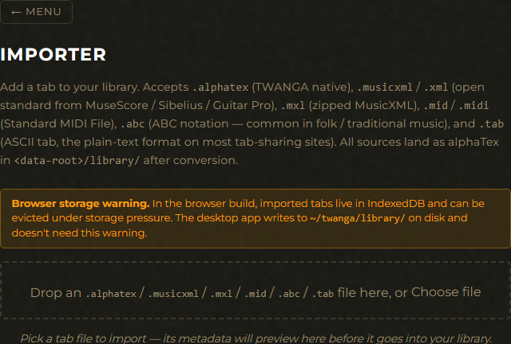
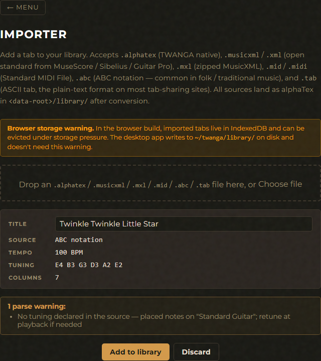

# Importer

Bring tabs from outside TWANGA into your library — alphaTex files,
MusicXML scores from MuseScore / Sibelius / Guitar Pro, zipped
`.mxl` archives, Standard MIDI Files, ABC notation tunes, and
plain-text ASCII tabs. Everything lands as alphaTex in
`<data-root>/library/` after conversion, so the rest of TWANGA
(Playback, Editor, the picker on `twanga play`) treats imports
identically to recordings.

The CLI surface mirrors the GUI exactly: `twanga import <path>` is
the one-shot "add this file to my library" verb, and `twanga convert
<input> --out <output>` is the stateless sibling for "transform this
file, don't save it anywhere."

## GUI

Open the Importer card from the main menu (or `#importer`).



Drop a file (or click **Choose file**). For a non-alphaTex source —
MusicXML, MXL — the parse + conversion runs immediately and the
preview card appears with the metadata the converter extracted:



The preview card populates with the parsed metadata before anything
lands in your library — you can edit the title, see the source
format / tempo / tuning / column count, and review any parse
warnings before committing.

### Preview fields

- **Title** — defaults to the source's embedded title (`\title` for
  alphaTex, `<work-title>` for MusicXML) or the filename's stem if
  neither is present. Editable; whatever's here becomes the filename
  slug + the in-library display name.
- **Source** — detected format. The conversion path runs through
  the same Rust code the CLI uses, so the saved alphaTex is
  bit-for-bit identical to what `twanga convert` would write.
- **Tempo / Tuning / Columns** — read-only summary of what the
  parser extracted. Useful sanity-check: a 4-string source on a
  6-string tuning is a sign something's mis-detected.

### Parse warnings

Non-alphaTex imports may produce non-fatal observations. The
shape is format-agnostic — the same set surfaces regardless of
whether the source was MusicXML, MIDI, ABC, or ASCII tab:

- **Irregular duration** — a note's duration didn't land on a
  power-of-2 division (dotted, triplet, swung). The importer
  rounds to the nearest standard denominator and notes the column.
- **Unreachable note** — a pitch couldn't be placed on the staff
  tuning within the 20-fret range. Dropped (or rest-padded) from
  the import; user can edit the source or pick a different target
  tuning externally.
- **Missing string tuning** — the source referenced an explicit
  string number but didn't include matching tuning info. The
  string mapping is best-effort; review the imported file before
  relying on the fingering.
- **Skipped track** — the source had multiple tracks / parts /
  voices and only the first note-bearing one was used. Surfaces
  for MusicXML's `<part>` blocks and MIDI's tracks.
- **Inferred tuning** — the source declared no tuning (or the
  tuning didn't match a built-in preset exactly). The importer
  picked the nearest built-in tuning and emits this warning so
  the user can retune at playback if the guess is wrong. Fires
  for every MIDI / ABC import (those formats have no tuning data
  at all) and for ASCII tabs with non-standard string labels.

Warnings don't block the import — they're surface-only diagnostics
so the user knows what to expect.

### Commit

**Add to library** writes the alphaTex bytes to the library backend
appropriate for the current surface:

- **Browser** — IndexedDB store, tagged `source: 'imported'`.
- **Tauri desktop** — `<data-root>/library/<slug>-<ts>.alphatex`.

Either way the Playback and Editor screens pick up the new entry on
their next render — no app restart needed.

## CLI

`twanga import <path>` mirrors the GUI exactly. `twanga convert`
splits out the stateless transform for scripting.

```
$ twanga import ./crazy-train.musicxml

════════════════════════════════════════════════════════════════
████████ ██     ██  █████  ███    ██  ██████   █████
   ██    ██     ██ ██   ██ ████   ██ ██       ██   ██
   ██    ██  █  ██ ███████ ██ ██  ██ ██   ███ ███████
   ██    ██ ███ ██ ██   ██ ██  ██ ██ ██    ██ ██   ██
   ██     ███ ███  ██   ██ ██   ████  ██████  ██   ██
════════════════════════════════════════════════════════════════
  Tablature, Woodshed, Arrangement, Notation, Grade, Analytics
════════════════════════════════════════════════════════════════

import: 2 parse warning(s):
  col 14: irregular duration '3' rounded to nearest power of 2
  col 27: note E6 unreachable on staff tuning — dropped
imported: ./crazy-train.musicxml (musicxml) -> /home/andrew/twanga/library/crazy-train-1779200000.alphatex
```

| Flag | Description |
|------|-------------|
| `path` (positional) | Path to the source file. Required. |
| `--from <fmt>` | Force the source format (`alphatex` / `musicxml` / `mxl`). Otherwise detected from extension. Useful when the file has a wrong / missing extension. |
| `--title <text>` | Override the title. Otherwise taken from the source's embedded title or "imported" if neither is present. The slug derived from this title forms part of the destination filename. |

The destination dir is `<data-root>/library/` — see
[User guide](user-guide.md#paths-and-portable-mode) for where that
resolves on each OS. The filename is `<slug>-<unix-secs>.alphatex`,
identical to `twanga record`'s convention.

### Stateless conversion

`twanga convert <input> --out <out>` does the same parse + serialise
but writes to an explicit path with no library involvement. Useful
for scripting bulk MusicXML → alphaTex transforms before importing,
or for one-off file sharing where the user just wants a converted
copy without committing it.

```bash
# Convert a MuseScore export to alphaTex without touching the library
twanga convert ./song.mxl --out ./song.alphatex

# Force the source format when the extension lies (e.g. alphaTex in a .txt)
twanga convert ./notes.txt --from alphatex --out ./notes.alphatex
```

| Flag | Description |
|------|-------------|
| `input` (positional) | Path to the source file. |
| `--out <path>` | Destination path. Will be overwritten if it exists. Required. |
| `--from <fmt>` | Force the source format. Otherwise detected from extension. |

## Where things live

- **Imports** — `<data-root>/library/<slug>-<ts>.alphatex` on
  native (CLI / Tauri); `IndexedDB` rows tagged `source: 'imported'`
  in the browser build.
- **Recordings** — `<data-root>/recordings/` (native) / IndexedDB
  rows tagged `source: 'user'` (browser). Distinct from imports so
  the file-system mirrors the data model — both surface in the
  Playback library with a per-row source tag.
- **MusicXML parser** — `crates/twanga-tabs/src/musicxml.rs`.
  Element coverage and limitations documented in the module docs.

## Supported source formats

| Format | Extension | Notes |
|---|---|---|
| alphaTex | `.alphatex`, `.txt` | TWANGA's native format. Parse-then-serialise normalises whitespace; bit-identical content otherwise. |
| MusicXML | `.musicxml`, `.xml` | Partwise scores (the dominant variant). Time-wise scores not supported in v1. |
| MXL | `.mxl` | Zipped MusicXML — the default export from MuseScore. Container manifest read first, then a fallback to the first `.xml` / `.musicxml` entry in the archive. |
| MIDI | `.mid`, `.midi` | Standard MIDI File (format 0 and 1, metrical timing). Pitches placed on the default tuning (standard guitar EADGBE) — surfaces an `InferredTuning` warning since MIDI carries no string/fret data. Multi-track files use the first note-bearing track and warn about the rest. |
| ABC notation | `.abc` | Folk / traditional text format. Monophonic single-voice subset; key signatures supply implicit accidentals. Same pitch-only tuning posture as MIDI. |
| ASCII tab | `.tab` (or `.txt` with `--from ascii`) | The plain-text dashes-and-frets format on tab-sharing sites. Tuning inferred from line labels (`e B G D A E` etc); falls back to the nearest built-in tuning by string count with an `InferredTuning` warning. |

Guitar Pro `.gp5` / `.gpx` are explicit non-goals — see
[SCOPE.md](../SCOPE.md). The MusicXML path covers the same
material because every engraver in that orbit exports to
MusicXML.

## See also

- [Playback feature](playback.md) — where imports show up after committing.
- [Tab editor feature](editor.md) — fix up imports cell-by-cell if the source parsed approximately.
- [User guide](user-guide.md) — paths, audio architecture, privacy.
- [CLI overview](../CLI.md) · [GUI overview](../GUI.md).
