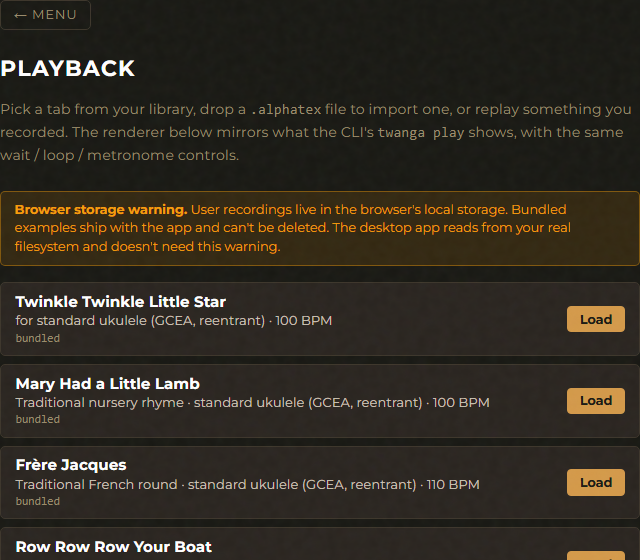
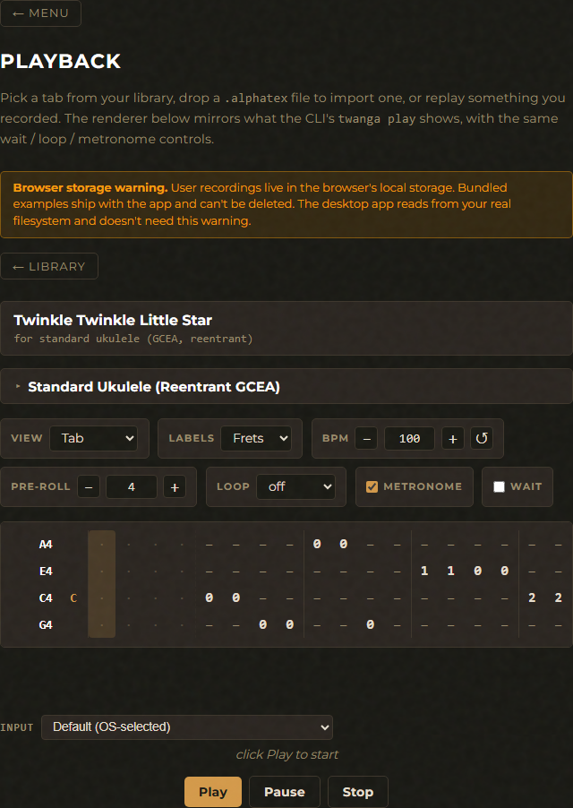
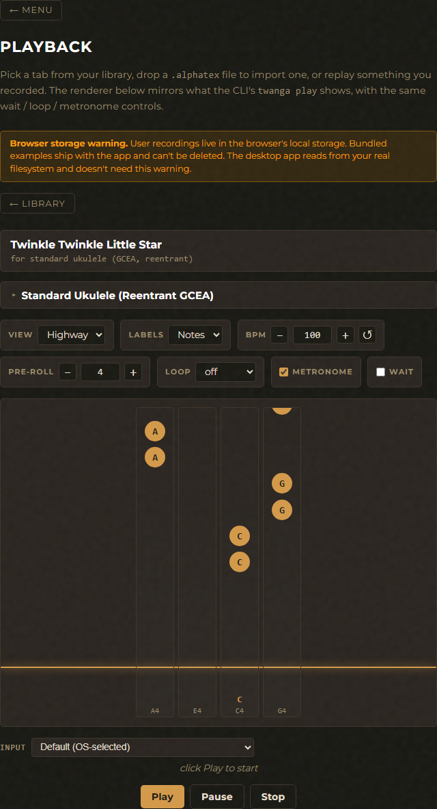

# Playback

Load an `.alphatex` tab, scroll a cursor through it at tempo with optional
metronome. Wait mode pauses at each note until you play it. Loop a section or
the whole file. Transpose onto a different instrument with the same alphaTex
parser used everywhere else.

A last-session resume bookmark is saved per file (or per session) on stop, so
re-opening the same tab offers to pick up where you left off. The library is
the same on both surfaces — bundled public-domain examples plus your own
recordings.

## GUI

Open the Playback card from the main menu (or `#playback`).

The screen has two views: a **library list** until a tab is loaded, then a
**per-tab playback view** with transport + settings. The library shows the
bundled public-domain examples that ship with every install — once you've
recorded a take in the sibling Recorder, your recordings appear above the
bundled rows (newest first).

### Library view



- **Tab rows** — bundled examples first, then user recordings (newest
  first). Each row shows the title, the tuning/instrument subtitle, and a
  source tag. User rows have Download + Delete; bundled rows are
  read-only.
- **Drop zone** — drag a `.alphatex` file (or click Choose file) to
  import.
- **Last-session resume banner** — appears above the library when there's
  a saved position. **Resume** loads that tab and starts at the saved
  column; **Dismiss** clears the bookmark.

### Per-tab playback view

Two renderer choices — Tab (column-grid notation) and Highway (falling-
notes view) — pair with two label modes (Frets / Notes) so you can
focus on either the *position* you need to play or the *note* it produces.
The same loaded tab in each combination:





- **Tuning picker + capo** — same shared controller as Tuner / Recorder.
  Lets you transpose the loaded tab onto a different instrument before
  playing. Tab's original tuning is pre-selected after load (via
  registry name-matching).
- **Transpose mode** — dropdown next to the tuning picker. Hidden
  when the current tuning fits everything (no notes drop in either
  mode); shown only when the choice matters. Hidden state still
  applies the persisted value invisibly the next time it's relevant.
  - `drop` — historical behaviour; notes that don't fit on the target
    are silently omitted and listed in the "Skipped:" preamble.
  - `octave-shift` — notes are retried at ±12 semitones before being
    dropped. Recommended for cross-instrument plays (e.g.
    banjo → ukulele clawhammer drones).
- **BPM** — number stepper. Reset button restores the file's stored
  tempo.
- **Loop** — dropdown with `off` / `full` / `range…`. `range…` reveals
  start + end column inputs. Equivalent to the CLI's `--loop` flag.
- **Pre-roll / metronome toggle** — same controls as the Recorder.
- **Playhead policy dropdown** — picks the scoring + advancement
  behaviour. Four options:
  - **Free play** — just scrolls, no scoring, no mic open.
  - **Wait** — cursor pauses on each note until you play it (Ship 1
    behaviour). Mic open, no scoring.
  - **Score: casual** — runs at tempo with a ±150 ms hit window per
    column. Tolerant of amateur timing.
  - **Score: tight** — same but ±50 ms. Useful once the user has
    calibrated their audio chain (see [Calibrate](calibrate.md));
    otherwise systematic hardware latency will skew everything Late.
- Wait / score modes open the mic and reveal the same mic-level meter
  (with input device picker + silence-threshold slider) the Recorder
  uses. Choices persist independently under
  `twanga-playback-device-v1` / `twanga-playback-silence-rms-v1`.
- **Latency status row** — under the mic meter when a score mode is
  selected: one-line readout of the calibration state. Shows the
  measured value when calibrated for the current mic; warns when the
  saved value is for a different device; prompts to visit the
  Calibrate screen when uncalibrated.
- **Renderer picker** — Tab or Highway view. Both surface a per-string
  **live-note cell** that shows the absolute pitch class (e.g. `C`,
  `F#`) for the fret being played at the playhead column on that
  string. Empty when the string isn't playing in the current column.
  Mirrors the CLI's `<label> | <note> | <body>` row shape.
- **Play / Pause / Stop** — spacebar shortcut for pause/resume. Pause
  pressed during wait closes out the wait segment so resume doesn't
  double-count time.
- **Skipped notes preamble** — surfaces up to 8 unique note names that
  didn't fit on the target tuning, plus the total count.

Saved position (per-tab last column played) lives in `localStorage`
under `twanga-playback-resume-v1`. Bookmark writes happen on Stop and on
Back-to-library. "Finished" stops don't save (replaying from the end is
useless).

### Score summary

At the end of a `tight` / `casual` session the score is printed inline:

```
Score:
  Hit:         12 (75%)
  Late:         2 (13%)
  Missed:       1 (6%)
  Wrong pitch:  1 (6%)
  Total notes: 16
```

Hit / Late / Missed / Wrong pitch are mutually exclusive per non-rest
column. The pairing window is generous (`late_ms × 4`) so a very-late
attack still pairs with the column the user was aiming at rather than
double-counting onto the next one.

## CLI

The audio loop runs under one of four playback policies, picked via the
`--policy` flag: `wait` (cursor pauses on each note), `casual` (run at
tempo, ±150 ms scoring), `tight` (run at tempo, ±50 ms scoring), or `free`
(no scoring, no mic). In wait mode the cursor pauses on each note until
the mic detects a matching pitch (±50 cents on any expected string/fret).
Rests still advance with time so the metronome stays musical. In score
modes, the end-of-session summary prints the same Hit / Late / Missed /
Wrong-pitch breakdown the GUI shows.

```
$ twanga play assets/examples/twinkle-twinkle-uke.alphatex --bpm 60

════════════════════════════════════════════════════════════════
████████ ██     ██  █████  ███    ██  ██████   █████
   ██    ██     ██ ██   ██ ████   ██ ██       ██   ██
   ██    ██  █  ██ ███████ ██ ██  ██ ██   ███ ███████
   ██    ██ ███ ██ ██   ██ ██  ██ ██ ██    ██ ██   ██
   ██     ███ ███  ██   ██ ██   ████  ██████  ██   ██
════════════════════════════════════════════════════════════════
  Track, Watch, Adjust, Notate, Grade, Again
════════════════════════════════════════════════════════════════

Title:   Twinkle Twinkle Little Star
Tuning:  Standard Ukulele (Reentrant GCEA) (4 strings)
Tempo:   60 BPM, 1/4 notes (1000 ms/col)
Length:  32 cols (32000 ms)

A4             | C  | 0 0 - - - - - - - - - - - - - -
E4             | G  | - - - - - - - - - - - - - - - -
C4             | C  | - - 3 3 - - - - 1 1 0 0 - - 2 2
g4 (reentrant) |    | - - - - - - - - - - - - - - - -
                       ^
[col 2 / 32, 1.0s elapsed]
```

Omit `path` to open an interactive picker that merges bundled examples,
bundled patterns, and any `.alphatex` files in `./recordings/` — same
library the GUI's Playback screen shows. The picker prefixes each row with
`[example]` / `[pattern · <group>]` / `[recording]` so the source is clear.

More examples:

```bash
# Play the uke arrangement on uke
twanga play assets/examples/twinkle-twinkle-uke.alphatex --bpm 60 --wait

# Transpose it to banjo, loop the first phrase
twanga play assets/examples/twinkle-twinkle-uke.alphatex \
    --tuning standard-banjo --bpm 70 --loop 0:16

# Same arrangement, with a capo on fret 3
twanga play assets/examples/twinkle-twinkle-uke.alphatex --capo 3

# Banjo tab on uke, octave-shifting bass drones up so they don't vanish
twanga play assets/examples/cripple-creek-banjo.alphatex \
    --tuning standard-ukulele --transpose-mode octave-shift
```

| Flag | Description |
|------|-------------|
| `path` (positional, optional) | Path to a `.alphatex` file. Omit to open the picker. |
| `--tuning <slug>` | Re-tune the tab to a different instrument. Notes are transposed by absolute pitch. |
| `--transpose-mode <drop\|octave-shift>` | What to do with notes that don't fit on the target tuning. `drop` (default) silently omits them and reports a "Skipped:" pre-flight summary. `octave-shift` retries each unreachable note at ±12-semitone offsets before giving up — the standard TuxGuitar / MuseScore convention. Particularly relevant for banjo→ukulele where bass drones would otherwise vanish. |
| `--capo <spec>` | Capo applied to the tab's tuning. Precedence: `--capo` wins; otherwise falls back to whatever the file embedded in its `\subtitle` field. |
| `--bpm <N>` | Override the tempo from the file. |
| `--no-metronome` | Silence the click (default is on). |
| `--wait` | Shorthand for `--policy wait`. Practice mode — cursor pauses at each note until you play it. |
| `--policy <wait\|tight\|casual\|free>` | Playback behaviour. `wait` pauses on each note; `tight` / `casual` run at tempo and score each column by proximity to expected onsets (±50 ms / ±150 ms hit windows); `free` just scrolls with no scoring. Score modes consume the [calibration](calibrate.md) value if one is stored — uncalibrated systems will see on-time plucks score Late under tight. |
| `--loop` | Loop the entire file continuously. |
| `--loop <START:END>` | Loop a column range (0-indexed, end exclusive). |
| `--pre-roll <N>` | Audible count-in ticks before playback starts (0–16). Default 4. |
| `--resume` | Auto-accept the saved bookmark for this file (if any) and jump to that column without the interactive prompt. Mirrors the GUI's "Resume" banner button. |
| `--no-resume` | Auto-decline any saved bookmark. Useful in scripts where you want a predictable start from column 0 regardless of history. |
| `--device "<name>"` | Wait-mode only. Substring-match against the audio input device list (see `twanga devices`). No-op without `--wait`. |
| `--silence-rms <RMS>` | Wait-mode only. Override the silence-gate threshold (linear-amplitude window-RMS, 0..1; default 0.005 ≈ -46 dB). |

Controls during playback (all `+ Enter`):

- `q` — stop (or Ctrl-C)
- `p` — pause / resume
- `[` / `]` — drop / raise the silence threshold by ~6 dB. Wait mode
  only — no-op without `--wait` since no mic is open.

**Last-session resume.** On any user-initiated stop, the CLI saves a
bookmark (the file's path + the current column + a `when` timestamp) to
`$CONFIG/twanga/play-resume.toml`. The next time you `twanga play` the
same file, you're prompted to resume from that column (`Y/n`, default
yes). Stale bookmarks pointing past the file's current length are
silently cleared. Naturally-finished plays don't save a bookmark.
Scripts can pass `--resume` (auto-accept) or `--no-resume` (auto-decline)
to skip the prompt. Same shape as the GUI's resume banner, just per-file
rather than most-recent-only.

## Where things live

- **CLI** — reads any `.alphatex` you can hand it via the path
  argument. Bundled examples live at `assets/examples/`.
- **GUI** — same bundled examples (shipped via
  `assets/examples/manifest.json`) merged with user recordings in
  IndexedDB. Drop-zone imports also go to IDB.

## See also

- [Calibrate feature](calibrate.md) — measure your audio chain's
  round-trip latency so `tight` / `casual` scoring credits on-time
  plucks correctly.
- [Recorder feature](recorder.md) — where most user-recordings come
  from.
- [Tab editor feature](editor.md) — fix up recordings cell-by-cell;
  the resulting file lands back in the same library.
- [Transpose mode trade-offs](../BACKLOG.md) — the "drop vs
  octave-shift" decision history.
- [CLI overview](../CLI.md) · [GUI overview](../GUI.md).
