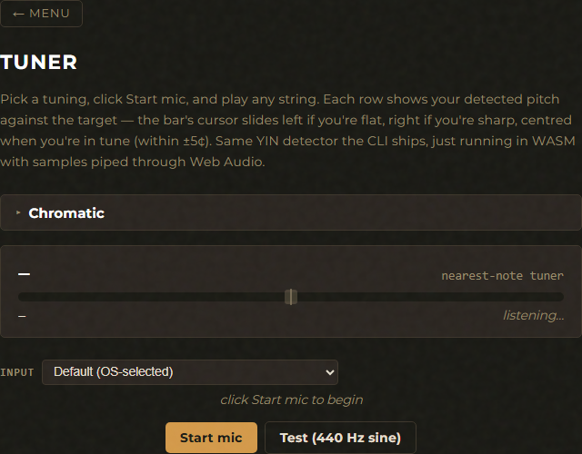

# Tuner

Live pitch detection vs your chosen tuning. Multi-string display with cents-off
indicators; chromatic mode (no instrument) snaps to the nearest 12-TET note.

The same Rust YIN implementation drives both surfaces — CPAL audio in the CLI,
Web Audio + AudioWorklet in the GUI, with the WASM bindings calling the
identical `twanga-dsp::Tuner`. Cable hum and silence are gated out the same way
on both. State (selected tuning, capo, silence threshold, input device) is
persisted per-surface so the next launch starts where you left off.

## GUI

Open the Tuner card from the main menu (or hash route `#tuner`).



- **Tuning picker** — built-in + user-defined tunings merged into one
  registry. First option is "chromatic (no instrument)" for a generic tuner.
- **Capo control** — uniform stepper or per-string panel (for drop-D /
  banjo 5th-string drone / partial capos).
- **Per-string display** — every open string of the selected tuning
  rendered as its own row with live frequency, target, and a cents-off
  indicator. The mic-level meter (small RMS bar) sits above the rows so
  you can tell "no signal" apart from "signal but no target match".
- **Input device picker** — dropdown above the meter, populated from
  `navigator.mediaDevices.enumerateDevices()`. Browsers gate the
  human-readable labels behind an existing permission grant, so the
  first list may show generic names; once you've granted mic access
  the labels populate properly. Hot-plug supported (USB mic in/out
  updates the list).
- **Silence-threshold slider** — vertical-line thumb overlaid on the
  mic-meter bar. Drag to set the gate; the bar fill shows live signal
  on the same axis. Fill crosses the thumb → detection fires; stays
  below → it doesn't. Same -6 dB / +6 dB intent as the CLI's
  `[` / `]` keys.

State persists to `localStorage` under `twanga-tuner-tuning-v1`. On Tauri the
same shape will round-trip to `$CONFIG/twanga/tunings.toml` once the
filesystem-sync command lands ([see the ROADMAP](../ROADMAP.md)).

## CLI

Prompts for a tuning if `--tuning` is omitted; the prompt includes
"(no instrument — chromatic tuner)" to disable per-string targets and just show
the nearest 12-TET note. When a tuning is selected, prompts again for a capo
position (default 0).

```
$ twanga tune --tuning standard-ukulele

════════════════════════════════════════════════════════════════
████████ ██     ██  █████  ███    ██  ██████   █████
   ██    ██     ██ ██   ██ ████   ██ ██       ██   ██
   ██    ██  █  ██ ███████ ██ ██  ██ ██   ███ ███████
   ██    ██ ███ ██ ██   ██ ██  ██ ██ ██    ██ ██   ██
   ██     ███ ███  ██   ██ ██   ████  ██████  ██   ██
════════════════════════════════════════════════════════════════
  Tuner, Waveforms, Arpeggios, Notation, Grading, Audio
════════════════════════════════════════════════════════════════

Tuning: Standard Ukulele (Reentrant GCEA) (4 strings)
Device: Microphone (Default)
Audio:  48000 Hz, 1 channel(s)

A4               | current:    442.10 Hz | target:    440.00 Hz | Tune Down! (+8.2 cents)
E4               | current:    326.40 Hz | target:    329.63 Hz | Tune Up! (-17.0 cents)
C4               | current:    261.10 Hz | target:    261.63 Hz | Tuned! (-3.5 cents)
g4 (reentrant)   | current:    392.10 Hz | target:    392.00 Hz | Tuned! (+0.4 cents)
```

| Flag | Description |
|------|-------------|
| `--tuning <slug>` | Any built-in slug (see `twanga tunings list`) or a user-defined one. Omit to be prompted. |
| `--capo <spec>` | Uniform integer (`--capo 3`) or per-string list (`--capo "0,2,2,2,2,2"`). Omit to be prompted (uniform only via prompt). |
| `--device "<name>"` | Substring-match against the audio input device list (see `twanga devices`). Omit to use the OS default. |
| `--silence-rms <RMS>` | Override the silence-gate threshold (window-RMS in linear amplitude, 0..1; default 0.005 ≈ -46 dB). Lower for quieter plucks at the cost of more cable-hum / room-noise false positives. |

Runtime keys (line-input, all `+ Enter`):

- `q` — stop (or Ctrl-C)
- `[` — drop silence threshold by ~6 dB (×0.5 RMS)
- `]` — raise silence threshold by ~6 dB (×2 RMS)

The threshold change prints a line like `[silence: 0.00500 RMS (-46.0 dB)]` so you can see what you've set. Useful when the default gate is rejecting genuine plucks; halve it twice and try again.

## Where things live

- **Tunings** — built-in presets are baked into the binary (and the WASM
  bundle). User-defined live at `$CONFIG/twanga/tunings.toml` (CLI) /
  `localStorage` key `twanga-user-tunings-v1` (GUI).
- **Audio device** — CLI uses the system default mic unless `--device
  "<name>"` is passed (substring match against `twanga devices`). GUI
  has its own dropdown picker that goes through
  `getUserMedia({ audio: { deviceId: { exact: ... } } })`; the choice
  persists in `localStorage` under `twanga-tuner-device-v1`.
- **Silence threshold** — runtime-tunable on both surfaces. CLI:
  `--silence-rms <RMS>` flag, or `[` / `]` runtime keys. GUI: the
  slider on the mic meter, persisted under
  `twanga-tuner-silence-rms-v1`.

## See also

- [Tunings feature](tunings.md) — defining custom tunings.
- [Recorder feature](recorder.md) — reuses the same tuning + capo machinery.
- [CLI overview](../CLI.md) · [GUI overview](../GUI.md).
