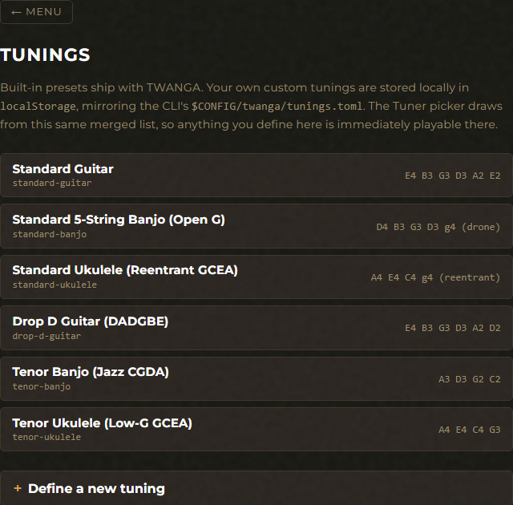

# Tunings

Built-in instrument presets + your own custom tunings, merged into a single
registry consumed by every other feature. The same TOML schema describes
both — built-in `presets.toml` is compiled into the binary, user-defined
lives at `$CONFIG/twanga/tunings.toml` (CLI) or `localStorage` (GUI).

Built-in slugs shadow user-defined ones so you can't silently override a
preset; the CLI's add-flow and the GUI's save-form both reject colliding
slugs upfront. A future Tauri sync command will round-trip the GUI's
`localStorage` shape into the CLI's TOML file so the two surfaces share
state on desktop.

## GUI

Open the Tunings card from the main menu (or `#tunings`).



- **Tuning list** — built-in entries first (read-only), then your
  custom ones with a per-row Delete button. Each row shows the display
  name and the open-string note sequence.
- **Define a new tuning** — collapsible form (`<details>` expando) with:
  - Display name (auto-derives a kebab-case slug shown live).
  - Per-string note names — type `A4`, `C#3`, etc. MIDI numbers
    preview as you go. Add / remove string rows.
  - Save validates the same way `twanga tunings add` does (slug
    shape, non-empty fields, MIDI in 0–127, no collision with
    built-ins).

User tunings persist to `localStorage` under `twanga-user-tunings-v1`.

## CLI

`twanga tunings <action>` — list / path / add / remove operations against the
registry.

```
$ twanga tunings list

════════════════════════════════════════════════════════════════
████████ ██     ██  █████  ███    ██  ██████   █████
   ██    ██     ██ ██   ██ ████   ██ ██       ██   ██
   ██    ██  █  ██ ███████ ██ ██  ██ ██   ███ ███████
   ██    ██ ███ ██ ██   ██ ██  ██ ██ ██    ██ ██   ██
   ██     ███ ███  ██   ██ ██   ████  ██████  ██   ██
════════════════════════════════════════════════════════════════
  Trustworthy, Without Ads, No Garbage Attached
════════════════════════════════════════════════════════════════

Standard Guitar (standard-guitar) [built-in]
  E4 B3 G3 D3 A2 E2

Standard 5-String Banjo (Open G) (standard-banjo) [built-in]
  D4 B3 G3 D3 g4 (reentrant)

Standard Ukulele (Reentrant GCEA) (standard-ukulele) [built-in]
  A4 E4 C4 g4 (reentrant)

Drop D Guitar (drop-d-guitar) [built-in]
  E4 B3 G3 D3 A2 D2

Tenor Banjo (Jazz CGDA) (tenor-banjo) [built-in]
  A4 D4 G3 C3

Tenor Ukulele (Low-G GCEA) (tenor-ukulele-low-g) [built-in]
  A4 E4 C4 G3

My Open D Guitar (my-open-d) [user]
  D4 A3 F#3 D3 A2 D2
```

The `tunings.toml` schema (same shape on disk):

```toml
[[tunings]]
slug = "my-open-d"
name = "My Open D Guitar"
strings = [
    { name = "D4", midi = 62 },
    { name = "A3", midi = 57 },
    { name = "F#3", midi = 54 },
    { name = "D3", midi = 50 },
    { name = "A2", midi = 45 },
    { name = "D2", midi = 38 },
]
```

You can hand-edit this file; the registry re-loads on every CLI invocation.

| Action | Description |
|--------|-------------|
| `twanga tunings list` | Print built-in + user-defined tunings with origin tags. |
| `twanga tunings path` | Print the absolute path to the user tunings file (whether it exists yet or not). |
| `twanga tunings add` | Interactive flow: number of strings → per-string open pitch → display name → auto-slug. Saves to the user file; rejects slugs that collide with built-ins. |
| `twanga tunings remove [--slug <slug>] [--force]` | Delete a user-defined tuning from the user file. Pass `--slug` to skip the menu; pass `--force` to skip the confirmation prompt (useful in scripts). Built-in tunings are compiled into the binary and can't be removed. |

## Where things live

- **Built-in presets** — `crates/twanga-core/src/presets.toml` (baked
  into the binary AND the WASM bundle).
- **User tunings**:
  - CLI: `$CONFIG/twanga/tunings.toml`. The exact path is whatever
    `twanga tunings path` prints. Platform examples:
    - Windows: `%APPDATA%\twanga\tunings.toml`
    - macOS: `~/Library/Application Support/twanga/tunings.toml`
    - Linux: `~/.config/twanga/tunings.toml`
  - GUI: `localStorage` key `twanga-user-tunings-v1`.

## See also

- [Tuner feature](tuner.md) — the most-used consumer of the registry.
- [Capo deep dive (in CLI overview)](../CLI.md) — capo spec syntax.
- [CLI overview](../CLI.md) · [GUI overview](../GUI.md).
